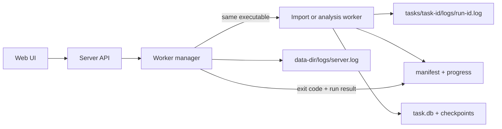

# M12 · 大型 Snapshot 可靠分析设计

## 版本与目标

M12 对应版本 `0.12.0`，开发分支为 `release/0.12.0`。

本里程碑解决大型 Snapshot 在 Windows 上分析时进程自行退出、任务永久停留在 `running`、缺少持久化日志、`mvcc-semantic` 阶段不可观测，以及 Kubernetes 语义分析在大量历史修订上写入和聚合过慢的问题。

现场证据为：1.2 GB Snapshot 在 `currentStage=mvcc-semantic` 时进程自行退出，用户没有主动关闭程序；遗留 `task.db` 约 218,460 KB，`task.db-wal` 约 8,281 KB，现有版本没有留下退出日志。因此能够确认进程级异常和诊断链路缺失，但不能反推出本次退出究竟由 panic、内存耗尽还是 Windows 文件映射错误引起。

## 已确认的现有问题

1. `Application.Start` 在后台 goroutine 中丢弃 `Runner.Start` 返回的错误，阶段 panic 会终止整个服务进程。
2. 任务状态先写 SQLite、再写 manifest，两者不是原子操作；恢复逻辑只相信 manifest，可能误判或遗留状态。
3. 服务关闭不取消或等待后台分析，正常退出也可能留下 `running`。
4. `logs/` 目录目前只被创建，没有任何代码向其中写日志。
5. `mvcc-semantic` 包含扫描、解码、明细写入、Key 聚合、前缀聚合、对象聚合和字段差异计算，但只在整个阶段开始和结束时更新一次状态。
6. Kubernetes 字段逐条写入，字段差异按每个修订单独查询，形成大量 SQL 执行和 N+1 查询；聚合又被包在一个长事务中。
7. JSON Kubernetes Value 完整解码且没有单 Value、深度或字段数量上限，属于待验证的内存耗尽风险。
8. worker、channel 和 SQLite batch 配置没有硬上限。
9. 进程内 map 只能阻止同一个服务实例重复启动任务，不能阻止两个进程同时使用同一数据目录。
10. 启动恢复遇到一个损坏或被锁定的任务数据库时会终止整个服务。
11. 现有百万修订测试只使用计数 sink，没有覆盖真实 SQLite 写入和 Kubernetes 聚合链路。

## 范围

### 本里程碑包含

- Snapshot 和 raw-db 的异步导入进度。
- Snapshot 和 raw-db 的隔离分析 worker。
- 项目自有目录中的服务日志和每次任务运行日志。
- worker 启动、取消、异常退出、panic、父进程退出和启动恢复。
- 任务 run ID、PID、退出码、当前子阶段、心跳、计数、速率和日志位置。
- manifest、checkpoint 与 SQLite 任务镜像的一致性规则。
- MVCC/Kubernetes 写入与字段差异聚合的直接性能优化。
- 大 Value、异常 JSON 和配置参数的资源边界。
- 中英文任务进度和日志查看界面。
- Linux、macOS 和 Windows 的自动化验证。

### 本里程碑不包含

- 将 Snapshot 差分任务迁移到隔离 worker。差分仍在服务进程内执行，并在发布说明中标记为剩余风险。
- 跳过 bbolt 完整性检查或改变物理分析结论。
- 丢弃正常 Kubernetes 历史字段或降低现有报告精度。
- 断点续传已经中断的文件复制或 MVCC 扫描。中断任务保留日志并明确失败，用户可重新创建任务。
- 依赖 Windows Event Log、syslog、journald、Windows 服务或第三方进程管理器。
- 新增 Go 或 npm 依赖。

## 总体架构

网页服务只负责 API、静态页面、任务调度、日志管理和 worker 监督。导入及分析由同一个可执行文件的隐藏 `worker` 子命令完成。父进程通过 `os/exec` 启动 worker，把 worker 的标准输出和标准错误直接重定向到任务运行日志，因此 Go runtime 的 panic 和 fatal 输出不依赖操作系统日志设施。



同一时间默认只允许一个分析 worker 和一个导入 worker。配置可把分析并发提高到 2，但硬上限为 2。父进程不持有正在运行任务的 SQLite 写连接；worker 是分析期间唯一的任务数据库写入者。

## 目录布局

```text
<data-dir>/
├── logs/
│   ├── server.log
│   ├── server.log.1
│   ├── server.log.2
│   └── server.log.3
├── runtime/
│   └── server.lock
└── tasks/<task-id>/
    ├── manifest.json
    ├── import-request.json
    ├── run.lock
    ├── run-result.json
    ├── source/input.db
    ├── task.db
    └── logs/
        └── <run-id>.log
```

`import-request.json` 只在异步导入期间保存原始输入路径，权限与任务目录一致，不通过 API 返回，也不写入日志；导入成功或失败后立即删除。`run-result.json` 仅保存安全错误码、运行模式、完成时间和计数，不保存 Value、原始 Key 或绝对路径。

## 项目自有日志

### 服务日志

`<data-dir>/logs/server.log` 由服务进程直接追加写入。每行采用可读的单行文本格式：RFC 3339 纳秒时间、级别、组件、事件、task ID、run ID 和安全字段。服务日志同时输出到原启动终端，但文件是诊断的持久化来源。

服务日志达到 10 MiB 后轮转，保留 `server.log.1` 至 `server.log.3`。轮转使用标准库文件操作和进程内互斥锁，不依赖操作系统日志管理工具。日志文件每条事件写入后同步到文件；进度事件最多每 2 秒一条，避免日志和 SSD 写放大。

### 任务运行日志

每次导入或分析使用独立的 `tasks/<task-id>/logs/<run-id>.log`。父进程在启动 worker 前以追加模式打开文件，并把同一个文件句柄设置为 worker 的 stdout 和 stderr。正常阶段事件、panic 堆栈、runtime fatal 信息和进程退出前输出都保留在同一文件中。

任务运行日志不在运行中轮转，因为每个 run 有独立文件且进度写入被限频。删除任务时一起删除。页面只读取当前任务最新 run 的末尾 200 行，服务端读取上限为 256 KiB。

### 日志安全

日志允许记录文件字节数、SHA-256、etcd 版本族、修订计数、字段计数、耗时、内存统计、SQLite/WAL 大小、错误类别和退出码。日志禁止记录：

- Kubernetes Value、Secret、ConfigMap 数据或字段内容；
- 完整原始 Key、对象敏感名称、用户名、令牌或证书；
- 原始外部输入绝对路径；
- HTTP 请求体和配置文件内容。

## worker 生命周期

服务使用当前可执行文件启动隐藏命令：

```text
etcd-analyzer worker --mode import|analysis --data-dir <path> --task <id> --run <id>
```

命令行只包含数据目录、任务 ID 和随机 run ID，不包含原始输入路径。worker 从任务私有文件读取导入请求。

父进程为 worker 保持一个控制管道。worker 单独监听管道 EOF；父进程取消、正常关闭或异常消失时，管道关闭并取消 worker context。父进程正常关闭时执行：停止接收新任务、关闭控制管道、等待最多 10 秒、仍未退出则终止子进程、保存安全终态。

worker 正常结束前原子写入 `run-result.json`。父进程等待退出后按 run ID 校验结果并写 manifest 终态：

- 退出码 0 且结果成功：导入进入 `pending`，分析进入 `completed`；
- worker 返回可处理错误：`failed`，保留明确错误码；
- worker 顶层 recover：记录堆栈，结果为 `WORKER_PANIC`；
- 非零退出且无结果：`WORKER_EXITED`，保存退出码并指向任务日志；
- 用户取消：`cancelled`；
- 父进程关闭或失联：`TASK_INTERRUPTED`。

Go runtime OOM 不能依赖 recover，但其 stderr 已由父进程在进程创建时重定向到任务日志，服务本身不会随 worker 一起退出。

## 锁与所有权

数据目录使用 `runtime/server.lock` 保证同一时间只有一个服务实例。任务运行使用 `run.lock` 保证一个 task 只有一个 owner。锁文件通过 `O_CREATE|O_EXCL` 原子创建，内容包含 owner ID、run ID、PID、模式、开始时间和最近心跳。

服务每 2 秒原子刷新 server lock；父进程每 2 秒刷新 active task lock。启动时若锁心跳在 15 秒内，拒绝第二实例或第二次任务启动；若锁已过期，先把旧锁原子重命名为带 owner ID 的 stale 文件，再竞争创建新锁。只有成功重命名旧锁的进程可以回收它。

锁是应用级单实例和所有权协议，不是对 Snapshot、SQLite 或用户文件施加系统级文件锁。

## 任务状态与一致性

manifest 是任务生命周期和进度的唯一权威来源。SQLite `tasks` 行只作为报告兼容镜像，不参与 worker 是否存活的判断。

新增状态 `importing`，状态流如下：

```text
create -> importing -> pending -> running -> completed
              |          |          |
              +--------> failed <----+
              +-------> cancelled <---+
```

manifest 新增：

```text
runId, runKind, workerPid, currentStage, stageProgress,
processed, total, unit, ratePerSecond, heartbeatAt,
elapsedSeconds, estimatedRemainingSeconds, logFile, exitCode
```

现有 `progress` 保留为整个导入或分析流程的 0 到 1 兼容字段。所有 progress 更新包含 run ID；过期 worker 不能覆盖新 run。manifest 临时文件名包含 run ID 和随机后缀，避免固定 `.tmp` 文件竞争。

worker 只在计数达到一个 batch 且距离上次持久化至少 2 秒时更新 manifest。SQLite checkpoint 在一个子阶段成功提交后写入。分析成功的顺序是：提交阶段数据和 checkpoint、关闭 SQLite、写成功 run result、worker 退出、父进程写 `completed` manifest。这样不会把未提交结果显示为完成。

启动恢复逐任务执行，单个任务恢复失败不会阻止服务启动：

1. `running/importing` 且 lock/heartbeat 已过期：标记 `TASK_INTERRUPTED`；
2. manifest 已完成但 SQLite 镜像落后：以 manifest 覆盖镜像；
3. SQLite 或 WAL 无法打开：任务标记 `RECOVERY_FAILED`，服务日志记录安全原因，继续恢复其他任务；
4. 旧版本没有 run ID 的 `running` 任务：标记 `TASK_INTERRUPTED`；
5. checkpoint 已完成但 manifest 未完成：不自动宣告任务成功，标记 interrupted，避免使用未验证结果。

## 异步导入

创建任务拆分为准备和导入：

1. API 验证名称、输入类型、路径可访问性和文件类型；
2. 创建任务目录、`import-request.json` 和 `importing` manifest；
3. 立即返回任务，由 worker manager 启动 import worker；
4. worker 以流式复制同时计算 SHA-256，每 2 秒报告已复制字节、总字节、速率和预计剩余时间；
5. 复制完成后同步目标文件、检测 etcd 版本、删除私有请求文件；
6. 父进程把任务改为 `pending`，用户继续使用现有“开始”操作启动分析。

导入使用临时目标 `source/input.db.partial`，成功同步后原子重命名为 `source/input.db`。失败或取消时删除 partial 文件，不留下看似完整的 Snapshot。

## 分析阶段与进度

M12 把当前粗粒度阶段拆为以下可见子阶段：

| 阶段 | 进度依据 | 关键日志 |
|---|---|---|
| `physical-open` | 不可量化，显示耗时和心跳 | 文件大小、bbolt 打开耗时 |
| `physical-integrity-check` | 不可量化，显示耗时和心跳 | 检查开始/结束、内存 |
| `physical-page-scan` | 已扫描页 / 总页 | 页数、速率 |
| `mvcc-scan` | 已扫描修订 / key bucket KeyN | scanned/decoded/skipped |
| `mvcc-write` | 已提交修订 / 已解码修订 | batch、WAL 大小 |
| `mvcc-key-aggregate` | 子阶段状态与耗时 | revision/key 数量 |
| `mvcc-prefix-aggregate` | 已处理 Key / Key 总数 | prefix 数量、速率 |
| `kubernetes-object-aggregate` | 子阶段状态与耗时 | object/revision 数量 |
| `kubernetes-diff-aggregate` | 已处理 Kubernetes 修订 / 总数 | field/diff 数量 |
| `report-generate` | 子阶段状态与耗时 | 输出字节数 |

无法可靠计算百分比的数据库操作不伪造 ETA；页面显示“正在执行”、已耗时和最近心跳。只在 total 已知且速率样本至少覆盖 5 秒时给出 ETA。

每个心跳记录 Go heap allocation、heap system、GC 次数和 goroutine 数，以及 `task.db`、WAL 文件大小。平台无法以标准库安全获得 RSS 时不显示 RSS，不引入平台依赖。

## MVCC 与 Kubernetes 性能修复

### SQLite 写入

每个 batch 的事务只准备一次 revision、Kubernetes revision 和 Kubernetes field insert statement，并在 batch 内复用。保留现有 batch 配置默认值 1000，不改变数据模型和分析结果。

### Kubernetes 字段差异

现有逐 Key、逐 revision 查询字段的 N+1 实现改为一个按 `key_hash, main_revision, sub_revision, path` 排序的流式 `LEFT JOIN` 查询。聚合器内存中只保留同一个 Key 的前一修订和当前修订字段，计算完立即释放，并用预编译 statement 分批提交 diff。

对象、diff、Resource、Namespace 和 summary 不再共用一个贯穿全部步骤的长事务。每个可恢复子阶段独立事务提交并写 checkpoint。任务运行中 UI 不开放分析结果，因此中间表暂时不完整不会被当作最终结果。

新增迁移为“最新修订最大字段”查询提供覆盖索引；最终索引以 `EXPLAIN QUERY PLAN` 测试为准，不重复已有 `UNIQUE(kube_revision_id, path)` 自动索引。

### 资源边界

- `workerCount`：1 到 8，默认仍不超过 4；
- `channelSize`：1 到 4096，默认 128；
- `sqliteBatchSize`：1 到 10,000，默认 1000；
- 同时分析任务：1 到 2，默认 1；
- 单个 Kubernetes Value 超过 32 MiB：保留 MVCC 修订元数据，Kubernetes decode status 记为 `oversized`，不展开 JSON；
- JSON 遍历深度超过 128 或字段节点超过 50,000：保留对象身份与 Value 字节数，decode status 记为 `field_limit_exceeded`；
- 额外字段仍只保留最大的 20 个，但使用有界选择结构，不先保存全部候选再排序。

这些上限显著高于正常 etcd/Kubernetes 对象范围，目的是让异常或损坏数据得到可解释的降级结果，而不是拖垮进程。启动时记录配置原值和最终值；超出硬上限直接拒绝启动并给出配置错误。

## API 与页面

任务 API 在保持现有字段兼容的基础上返回新增进度字段。新增只读接口：

```text
GET /api/v1/tasks/<task-id>/logs?tail=200
```

接口只允许 1 到 200 行，最多读取文件末尾 256 KiB，只读取 manifest 指向且仍位于任务 `logs/` 下的文件。响应包含安全文本行、日志相对路径、文件大小和最后修改时间，不返回绝对路径。

任务列表和详情增加：

- `importing` 状态；
- 本地化阶段名称；
- 当前阶段与阶段进度；
- processed / total、速率、耗时和 ETA；
- 最近心跳时间；心跳超过 10 秒显示“任务可能无响应”；
- 失败错误码、退出码和“查看日志”；
- 运行中和失败任务的日志末尾面板。

页面继续每 2 秒轮询，不引入 WebSocket。日志面板打开时才读取日志接口。

## 错误处理

用户可见错误保持安全摘要，详细技术信息只进入任务日志。新增错误码：

- `IMPORT_WORKER_START_FAILED`
- `ANALYSIS_WORKER_START_FAILED`
- `WORKER_PANIC`
- `WORKER_EXITED`
- `WORKER_RESULT_INVALID`
- `TASK_HEARTBEAT_LOST`
- `TASK_INTERRUPTED`
- `TASK_OWNED_BY_ANOTHER_PROCESS`
- `DATA_DIR_IN_USE`
- `RECOVERY_FAILED`
- `ANALYSIS_RESOURCE_LIMIT`

父进程保存终态失败时必须写 server log，并在内存中保留一次有界重试；服务启动恢复仍会根据 stale lock 和 run result 完成对账。

## 跨平台约束

- 进程创建、标准流重定向、控制管道、路径、原子文件替换和终止均使用 Go 标准库。
- 不使用 Windows Event Log、systemd、syslog、Windows 服务或外部 supervisor。
- Windows 父进程关闭时依靠继承控制管道的 EOF 通知 worker；强制取消使用 `Process.Kill`。
- worker 退出后父进程必须关闭日志句柄和控制管道，再允许删除任务，避免 Windows 文件占用错误。
- 日志和 manifest 内部路径统一保存为 slash 分隔的相对路径，实际访问继续用 `filepath` 和 containment 检查。

## 安全与隐私

- worker 隐藏命令仍验证 task ID、run ID、路径 containment 和 run lock owner，不能分析任意外部路径。
- `import-request.json` 不经 API 返回，导入结束立即删除。
- 日志 API 不接受客户端文件路径，只读取 manifest 中当前 run 的相对日志路径。
- 所有错误日志经过安全字段构造，不直接格式化 Kubernetes 对象、Value 或请求体。
- 现有 Value-free 分析、Secret 名称脱敏、输入 symlink 拒绝和任务删除 containment 保持不变。

## 验证策略

### 自动化测试

- logger：追加、同步、10 MiB 轮转、并发写和敏感文本禁止测试；
- worker manager：正常退出、返回错误、panic、直接非零退出、取消、父控制管道 EOF 和超时强制终止；
- lock：双进程竞争、15 秒 stale 回收、过期 run 不能覆盖新 manifest；
- recovery：DB/manifest 不一致、旧版 running、损坏单任务不阻止服务启动；
- import：异步状态、字节进度、SHA-256、partial 原子替换、取消清理和私有请求删除；
- progress：2 秒限频、阶段计数、未知 total 不生成 ETA、心跳超时显示；
- MVCC storage：prepared batch 写入保持现有数据；
- Kubernetes aggregation：流式 diff 与现有 fixture 结果一致，零字段修订、tombstone 和 batch 边界正确；
- resource limits：超大 Value、深层 JSON、字段节点上限和配置硬上限；
- API/UI：日志 tail containment、200 行上限、中英文阶段文案和失败日志入口；
- Windows：原生 worker 创建、stderr 捕获、父进程退出、文件句柄释放和任务删除。

### 性能验证

增加可选完整链路测试，不再使用只计数 sink：

- 20,000 个 Kubernetes 修订、1,000 个逻辑 Key、每修订 20 个字段；
- 100,000 个普通 MVCC 修订；
- 环境变量启用的 1,000,000 修订和 1 GiB 级生成数据测试。

20,000 修订基准应记录扫描写入、Key 聚合、Kubernetes 聚合、task.db 和 WAL 大小。与 v0.10.0 同机基线相比，Kubernetes 写入加聚合耗时至少降低 3 倍，派生数据库大小不得增加。性能门槛只用于同机专用基准，不作为共享 CI 的易抖动时间断言。

### 完整发布验证

- `go test ./...`
- `go test -race` 覆盖 task、app、worker 和 analyzer 相关包
- `go vet ./...`
- Web locale、typecheck 和 production build
- Linux、macOS、Windows GitHub Actions
- Windows 原生 1.2 GB 现场 Snapshot 重试，确认服务不退出、日志可读、进度持续更新；若 worker 仍退出，任务必须在 5 秒内进入 failed 并保留 runtime 输出。

## 验收标准

1. worker panic、fatal 或非零退出不能终止网页服务。
2. 所有服务和任务日志写入项目数据目录，不依赖操作系统日志工具。
3. worker 异常退出后，任务在 5 秒内从 `running/importing` 进入明确终态，保留 run ID、退出码、最后阶段和日志。
4. 导入 1 GB 以上文件时，页面至少每 2 秒显示复制字节、速率和心跳。
5. `mvcc-semantic` 不再作为一个不可区分的长阶段，页面能定位扫描、写入或具体聚合子阶段。
6. 一个损坏任务不能阻止服务启动和其他任务恢复。
7. 同一数据目录不能启动两个服务，同一任务不能启动两个 worker。
8. 正常输入的 MVCC、Kubernetes、差分和报告结果与现有版本兼容。
9. 异常大对象得到可解释的 semantic decode 降级结果，不导致服务进程退出。
10. 20,000 Kubernetes 修订专用基准在同机上至少提速 3 倍，派生数据库不增大。
11. Windows、Linux 和 macOS 完整测试、竞态检查、静态检查和前端构建通过。

## 兼容与发布

旧 manifest 缺少新增字段时按零值读取；旧的 pending/completed/failed/cancelled 任务继续可见。旧的 running 任务首次启动 0.12.0 时按 `TASK_INTERRUPTED` 恢复。数据库迁移只新增必要索引和 decode status 数据，不删除现有表或字段。

`VERSION`、Web package 版本、README 与 `RELEASE.md` 在实现完成并验证后更新为 `0.12.0`。只有合并到 `main` 后才创建 annotated tag `v0.12.0`。

## 延后事项

- Snapshot 差分迁移到统一 worker manager；
- 已中断导入或 MVCC 扫描的断点续作；
- bbolt 版本检测、完整性检查和语义扫描的读取复用；
- 输入路径 TOCTOU 的进一步加固；
- 任务日志搜索、下载和长期归档；
- 平台专用 RSS、I/O 与 Windows Job Object 指标。
